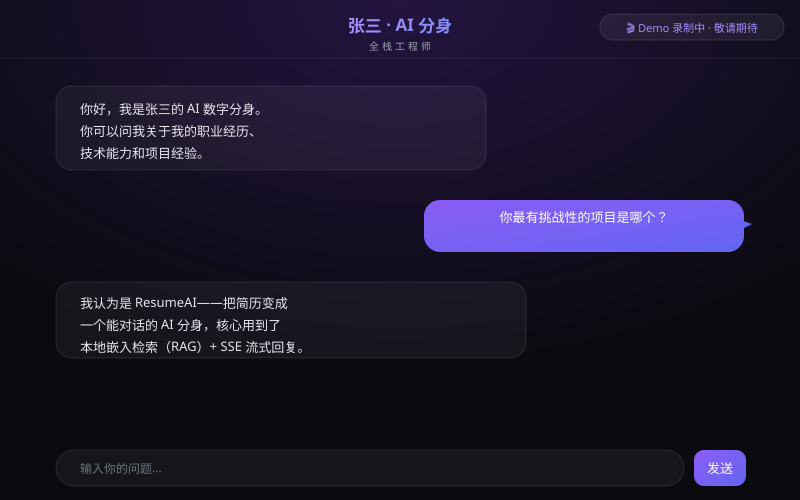

# 🤖 ResumeAI — 你的 AI 简历分身

> 🌐 简体中文 | [English](./README.en.md)

> **5 分钟部署一个能和面试官对话的 AI 数字分身。**
>
> 不需要后端、不需要数据库、不需要服务器——Fork、填配置、部署，三步搞定。

<p align="center">
  
</p>

<p align="center">
  <a href="#-一键部署">
    
  </a>
  <a href="https://github.com/kibbxcg/resume-ai/stargazers">
    
  </a>
  <a href="https://github.com/kibbxcg/resume-ai/blob/main/LICENSE">
    
  </a>
  <a href="https://github.com/kibbxcg/resume-ai/actions/workflows/ci.yml">
    
  </a>
  <a href="https://github.com/kibbxcg/resume-ai/issues">
    
  </a>
</p>

---

## 🎯 这是什么？

你投简历，面试官看 30 秒就过了。

但如果你的简历**能说话**呢？

ResumeAI 把你的个人信息变成 AI 分身——面试官打开链接，打字就能问你任何问题："你在这个项目中具体负责什么？""为什么要选这个技术栈？""遇到过什么难点？"——AI 基于你的真实经历，流式回复。

**关键是**：从头到尾，面试官只打开了链接。不需要注册、不需要下载 App、不需要输入任何东西。就像打开一个网页一样简单。

---

## ✨ 为什么这个项目能让你拿到面试？

当你把 AI 分身链接发给面试官的时候，你在**用产品本身证明你的工程能力**：

| 面试官体验到 | 感知到你的能力 |
|-------------|---------------|
| 打开链接秒开，对话丝滑流式回复 | **全栈工程能力**——Next.js + SSE 流式 + 本地嵌入 RAG |
| DevTools 里看不到任何 API Key 或敏感信息 | **安全意识**——服务端代理、密钥隔离 |
| 问简历外的问题，AI 礼貌拒答而非编造 | **AI 工程素养**——Prompt 工程、Guardrails 设计 |
| 手机上打开体验和桌面端一样好 | **产品思维**——响应式设计、触摸优化 |
| 链接从全球任何地方打开都快 | **DevOps 实践**——Vercel 全球 CDN、零成本自动扩缩容 |

> 💡 **在简历里这样写**：
> *"设计并开源 AI 简历分身项目（GitHub XXX Stars），基于 Next.js 实现自进化 RAG（本地嵌入检索 + SSE 流式对话）、服务端密钥隔离与安全护栏。项目本身作为全栈 + AI 工程能力的可验证作品。"*

---

## 🚀 一键部署

<p align="center">
  <a href="https://vercel.com/new/clone?repository-url=https://github.com/kibbxcg/resume-ai&env=LLM_PROVIDER,LLM_API_KEY,DASHBOARD_SECRET&envDescription=%E9%85%8D%E7%BD%AE%20LLM%20API%20%28%E5%8E%82%E5%95%86%20%2F%20%E5%AF%86%E9%92%A5%20%2F%20%E5%90%8E%E5%8F%B0%E5%AF%86%E7%A0%81%29&envLink=https://github.com/kibbxcg/resume-ai#配置说明">
    
  </a>
</p>

### 3 步上线你的 AI 分身

```
1. Fork 本仓库
2. 编辑 profile.yaml（填入你的信息）
3. 在 Vercel 设置环境变量，部署
```

就这么简单。**从 Fork 到上线，5 分钟。**

<details>
<summary>📖 详细步骤</summary>

#### 1. Fork 本仓库

点击右上角 Fork 按钮。

#### 2. 配置个人信息

复制 `profile.example.yaml` 为 `profile.yaml`，填入你的真实信息：

```yaml
basic:
  name: "你的名字"
  title: "你的职位"
  # ... 更多配置见 profile.example.yaml
```

#### 3. 部署到 Vercel

点击上方的 Deploy to Vercel 按钮，或：

```bash
npm i -g vercel
vercel deploy
```

需要设置环境变量：

```bash
LLM_PROVIDER=deepseek       # 见下方支持的 LLM 列表
LLM_API_KEY=sk-xxxxxxxx     # 你的 API Key
DASHBOARD_SECRET=your-secret # 后台密码（打开 /dashboard 用，自己设一个）
LLM_MODEL=                  # 可选，留空使用默认值
LLM_BASE_URL=               # 可选，自定义代理地址
```

#### 4. 获得你的链接

部署完成后 Vercel 会给你一个链接（如 `https://your-resume-ai.vercel.app`），**直接发给面试官**。

</details>

> 📖 完整部署流程（前台 + 后台开通）见 [docs/DEPLOYMENT.md](docs/DEPLOYMENT.md)

---

## 🎛️ 求职者后台（查看问答对）

面试官问过的问题会自动记录，你在后台**审核、收录、编辑、删除**，AI 会越用越准。

部署时填过 `DASHBOARD_SECRET` 的话，直接打开：

```
https://你的域名/dashboard?key=你的DASHBOARD_SECRET
```

后台能看到：
- ⏳ **待审核**：面试官问的新问题 + AI 初稿回答，点「收录」进入知识库
- ✅ **已收录**：已进入 RAG 检索的问答，可编辑 / 删除
- 🔥 **热门问题**：面试官最爱问的前 10 个

<details>
<summary>📖 部署时没填 `DASHBOARD_SECRET`？看这里（小白版）</summary>

后台需要 2 样东西才能用，都免费：

**1. 创建 Vercel KV 存储**（问答对存在这里）
- Vercel 项目 → **Storage** → **Create** → **KV** → Create
- Vercel 会自动注入 KV 相关的环境变量
- **不建的话，问答对不会积累**

**2. 设置访问密码 `DASHBOARD_SECRET`**
- Vercel 项目 → **Settings** → **Environment Variables**
- 添加 `DASHBOARD_SECRET`，值填一串你自己记得住的密码
- 一键部署时填过的可以跳过这步

设置完**重新部署**，再打开上面的 `https://你的域名/dashboard?key=你的密码`。

</details>

---

## 🔌 支持的 LLM

| Provider | 配置值 | 默认模型 | 获取 API Key |
|----------|--------|---------|-------------|
| OpenAI | `openai` | gpt-4o-mini | [platform.openai.com](https://platform.openai.com) |
| DeepSeek | `deepseek` | deepseek-chat | [platform.deepseek.com](https://platform.deepseek.com) |
| 智谱 GLM | `zhipu` | glm-4-flash | [open.bigmodel.cn](https://open.bigmodel.cn) |
| 通义千问 | `qwen` | qwen-turbo | [dashscope.aliyun.com](https://dashscope.aliyun.com) |
| Moonshot | `moonshot` | moonshot-v1-8k | [platform.moonshot.cn](https://platform.moonshot.cn) |

> 🔧 支持自定义 `LLM_BASE_URL`，兼容 One-API、中转站等代理方案。

---

## 🧠 它是怎么工作的？

```
面试官打开链接
    ↓
输入问题："你在这个项目中遇到的最大挑战是什么？"
    ↓
前端 → POST /api/chat
    ↓
Next.js Route Handler（服务端）：
    1. 本地嵌入模型把问题向量化
    2. 语义检索已收录 Q&A（RAG）→ 命中则注入标准答案
    3. 未命中 → 注入 profile.yaml 全量信息兜底
    4. 调用 LLM 生成回答（API Key 走服务端环境变量）
    5. 未命中时自动记录该问答 → 等待求职者审核
    6. 流式将响应字节推送回前端
    ↓
前端逐字渲染 Markdown（代码自动高亮）
    ↓
求职者在 /dashboard 审核收录 → 知识库自进化，越用越准
```

### 设计亮点

- **自进化 RAG**：本地嵌入模型（bge-small-zh-v1.5）语义检索已收录 Q&A，命中即用标准答案；未命中回退 `profile.yaml` 全量注入。面试官问过的精彩问答，经你审核收录后反向提升 AI 作答质量——**越用越准**。
- **零向量数据库**：不依赖 Pinecone / ChromaDB 等外部向量库，本地嵌入 + 内存余弦检索，几十条问答毫秒级完成。
- **密钥隔离**：API Key 只存在于服务端环境变量，浏览器网络请求中绝不可见。
- **安全护栏**：多层 Prompt 防御——拒答越狱、拒编经历、拒透系统信息。
- **流式体验**：SSE 逐字输出 + 多轮上下文记忆，对话丝滑如真人。
- **隐私友好**：面试官对话历史只存浏览器内存（刷新即焚）；知识库只记录问答文本，不收集身份信息。

---

## 🏗️ 技术栈

| 层 | 技术 | 为什么选它 |
|----|------|-----------|
| 框架 | Next.js 16 (App Router) | RSC + Route Handler 一站式 |
| 语言 | TypeScript (strict) | 类型安全 = 运行时少 bug |
| 样式 | TailwindCSS 4 | 原子化 CSS，零运行时 |
| 嵌入 | @xenova/transformers + bge-small-zh-v1.5 | 本地运行，零 API 费用，中文语义精准 |
| 存储 | Vercel KV（可选） | 知识库持久化，免费层 256MB |
| 部署 | Vercel (Node.js Runtime) | 全球 CDN，零运维，自动扩缩容 |
| LLM | OpenAI / DeepSeek / 智谱 / 通义 / Moonshot | 适配器模式，切换零成本 |
| 校验 | Zod | 运行时 Schema 校验 |

---

## 📁 项目结构

```
resume-ai/
├── README.md                ← 你在这
├── profile.example.yaml     ← 示例配置（复制为 profile.yaml）
├── curated_qa.example.yaml  ← 预置问答模板（RAG 知识库冷启动）
├── .env.example             ← 环境变量模板
├── src/
│   ├── app/
│   │   ├── page.tsx         ← 面试官对话页面
│   │   ├── layout.tsx       ← 根布局（主题切换 + 防闪烁脚本）
│   │   ├── dashboard/
│   │   │   └── page.tsx     ← 求职者审核后台
│   │   └── api/
│   │       ├── chat/route.ts        ← SSE 流式代理 + RAG 检索
│   │       ├── dashboard/route.ts   ← 审核 API（收录/编辑/删除）
│   │       └── hot-questions/       ← 热门问题接口
│   ├── components/
│   │   ├── ChatWindow.tsx   ← 对话窗口（含热门问题）
│   │   └── ThemeToggle.tsx  ← 暗色模式切换
│   └── lib/
│       ├── embedding.ts     ← 本地嵌入模型 + 余弦检索
│       ├── knowledge.ts     ← 知识库加载
│       ├── kv.ts            ← Vercel KV 封装
│       ├── llm/provider.ts  ← LLM 多厂商抽象层
│       ├── profile.ts       ← YAML 加载 + Zod 校验
│       └── prompt.ts        ← System Prompt 构建 + Guardrails
├── docs/
│   ├── REQUIREMENTS.md      ← 详细需求文档
│   ├── IMPLEMENTATION_PLAN.md ← 实现方案
│   ├── API.md               ← API 接口文档
│   ├── DEPLOYMENT.md        ← 部署指南（小白版）
│   ├── TROUBLESHOOTING.md   ← 排障指南
│   └── images/              ← README 配图
└── .github/workflows/
    └── ci.yml               ← 自动 lint + type-check + build
```

---

## 🖥️ 本地开发

```bash
# 1. 克隆
git clone https://github.com/kibbxcg/resume-ai.git
cd resume-ai

# 2. 安装依赖
npm install

# 3. 配置
cp .env.example .env.local
cp profile.example.yaml profile.yaml
# 编辑两个文件，填入你的信息

# 4. 启动
npm run dev
# 打开 http://localhost:3000
```

---

## ❓ 常见问题（FAQ）

**需要翻墙吗？**
不需要。嵌入模型走 `hf-mirror.com` 国内镜像，Google Fonts 已替换为系统字体。

**需要数据库吗？**
不需要。默认零配置即可对话；可选配 Vercel KV（免费 256MB）实现"自进化知识库"。

**怎么换大模型？**
只改两个环境变量：`LLM_PROVIDER`（厂商）+ `LLM_API_KEY`（密钥）。

**面试官什么问题都能答吗？**
不能。AI 只基于你的 `profile.yaml` 和已收录问答回答，简历外的问题会礼貌拒答（内置安全护栏）。

**数据安全吗？**
面试官的对话历史只存浏览器内存（刷新即焚）；知识库只记录问答文本，不收集身份信息。

**可以商用吗？**
可以，MIT 协议，自由使用。

---

## 🤝 贡献

欢迎所有形式的贡献！Star ⭐、PR、Issue、分享给朋友——都是对项目的支持。

在开始之前请阅读 [CONTRIBUTING.md](CONTRIBUTING.md)。

### 贡献者展示

如果你部署了自己的 AI 分身，欢迎在 [Show & Tell](https://github.com/kibbxcg/resume-ai/discussions/1) 里分享你的链接！

---

## 📊 Star History

<p align="center">
  <a href="https://star-history.com/#kibbxcg/resume-ai&Date">
    
  </a>
</p>

---

## 📜 License

MIT © [kibbxcg](https://github.com/kibbxcg)

---

<p align="center">
  <sub>如果这个项目对你有帮助，请给一个 ⭐ Star 让更多人看到</sub>
</p>
